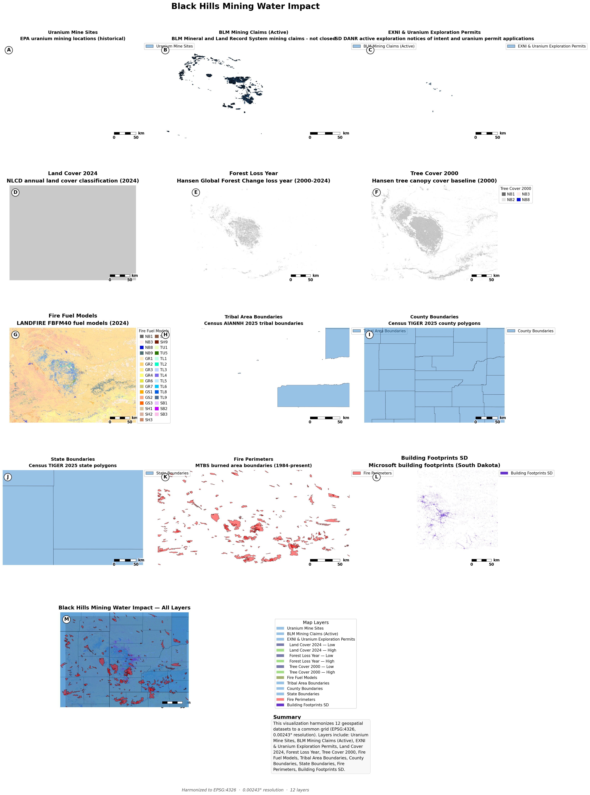

{ .page-hero }

# Black Hills Mining & Water Impact Analysis

Harmonizes mining sites, hydrological features, land cover, tribal boundaries, and fire history for the Black Hills region (South Dakota & Wyoming) to assess historical and future impacts of mining on water resources, with emphasis on sovereign tribal lands.

---

## Prompt

> "Create a comprehensive harmonization workflow for the Black Hills region covering mining impacts on water resources with emphasis on tribal lands. Include all available datasets from the data catalog covering the region with full historical temporal coverage."

---

## Datasets

| Layer | Type | Source |
|---|---|---|
| Uranium Mine Sites | vector | https://www.epa.gov/sites/default/files/2015-03/uld-ii_gis.zip |
| BLM Mining Claims (Active) | vector | https://gbp-blm-egis.hub.arcgis.com/api/download/v1/items/abec5ef96dc8495d9c29a01b30cc04ee/shapefile?layers=0 |
| EXNI & Uranium Exploration Permits | vector | SD DANR PDFs → PLSS geocoding (local GeoJSON, see `parse_exni_to_geojson.py`) |
| Land Cover 2024 (NLCD) | raster | https://www.mrlc.gov/downloads/sciweb1/shared/mrlc/data-bundles/Annual_NLCD_LndCov_2024_CU_C1V1.zip |
| Forest Loss Year (Hansen) | raster | https://storage.googleapis.com/earthenginepartners-hansen/GFC-2024-v1.12/Hansen_GFC-2024-v1.12_lossyear_50N_110W.tif |
| Tree Cover 2000 (Hansen) | raster | https://storage.googleapis.com/earthenginepartners-hansen/GFC-2024-v1.12/Hansen_GFC-2024-v1.12_treecover2000_50N_110W.tif |
| Fire Fuel Models (FBFM40) | raster | https://www.landfire.gov/data-downloads/CONUS_LF2024/LF2024_FBFM40_CONUS.zip |
| Tribal Area Boundaries (AIANNH) | vector | https://www2.census.gov/geo/tiger/TIGER2025/AIANNH/tl_2025_us_aiannh.zip |
| County Boundaries | vector | https://www2.census.gov/geo/tiger/TIGER2025/COUNTY/tl_2025_us_county.zip |
| State Boundaries | vector | https://www2.census.gov/geo/tiger/TIGER2025/STATE/tl_2025_us_state.zip |
| Fire Perimeters (MTBS) | vector | https://edcintl.cr.usgs.gov/downloads/sciweb1/shared/MTBS_Fire/data/composite_data/burned_area_extent_shapefile/mtbs_perimeter_data.zip |
| Building Footprints SD | vector | https://minedbuildings.z5.web.core.windows.net/legacy/usbuildings-v2/SouthDakota.geojson.zip |

**Target grid:** EPSG:4326 · extent (-105.5°, 42.5°, -101.5°, 45.5°) · resolution ~270 m (0.00243°)

**Clip boundary:** Black Hills region with ~100 mile buffer covering South Dakota, Wyoming, and partial Nebraska overlap.

---

## What Was Harmonized

- **Uranium Mine Sites**: EPA historical uranium mining locations reprojected to EPSG:4326, clipped to Black Hills extent, kept as vector (583 features).
- **BLM Mining Claims (Active)**: BLM Mineral and Land Record System (MLRS) mining claims not closed, reprojected to EPSG:4326, clipped to Black Hills extent, kept as vector (12,541 features).
- **EXNI & Uranium Exploration Permits**: 6 active SD DANR exploration applications (Daniel Hoff, F3 Gold LLC, Clean Nuclear Energy Chord Project, Clean Nuclear Energy October Jinx Project, Pete Lien & Sons EXNI 469 Rochford Graphite, Solitario Resources Corp EXNI 470 Ponderosa Project). Locations derived from legal PLSS descriptions in PDF applications, converted to GeoJSON polygons using Black Hills Meridian math (see `parse_exni_to_geojson.py`). Test hole locations are confidential per SDCL 45-6C-14 and SDCL 45-6D-15.
- **NLCD Land Cover 2024**: Annual land cover classification resampled with nearest-neighbor to preserve integer class codes.
- **Hansen Forest Loss Year**: Forest loss timeline (2000-2024) resampled with nearest-neighbor (categorical).
- **Hansen Tree Cover 2000**: Baseline tree canopy cover (2000) resampled with bilinear interpolation (continuous percentage).
- **FBFM40 Fuel Models**: LANDFIRE fire behavior fuel models resampled with nearest-neighbor (categorical). Color map loaded from Landfire CSV.
- **Tribal Area Boundaries (AIANNH)**: Census AIANNH 2025 tribal boundaries reprojected and clipped to region.
- **County Boundaries**: Census TIGER 2025 county polygons reprojected and clipped.
- **State Boundaries**: Census TIGER 2025 state polygons reprojected and clipped.
- **MTBS Fire Perimeters**: Historical burned area boundaries (1984-present) kept as vector, clipped to region.
- **Building Footprints SD**: Microsoft building footprints for South Dakota rasterized to presence/absence at ~270 m resolution.

---

## Excluded Datasets

- **USGS WBD (Watershed Boundaries)**: GDB format not supported by harmonizer (requires .shp or .geojson).
- **USGS 3DHP (Hydrography)**: GeoPackage format not supported.
- **National Atlas of Indian Lands**: `.tar.gz` archive format not supported (harmonizer only extracts `.zip`).
- **TerraClimate / NOAA NClimGrid (STAC)**: Planetary Computer STAC assets require blob URL signing (authentication) that the harmonizer cannot perform.

---

## Result



---

## Reproduce It

From the repo root:

```bash
python workflows/black_hills_mining_water_impact/black_hills_harmonization.py
```

Outputs are saved to `workflows/black_hills_mining_water_impact/output/`.

---

## Source

Script: `workflows/black_hills_mining_water_impact/black_hills_harmonization.py`
