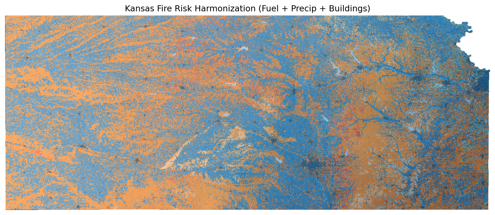

{ .page-hero }

# Kansas Fire Risk

Harmonizes fire behavior fuel models, winter precipitation projections, historical burned areas, and building footprints for Kansas to assess fire risk factors.

---

## Prompt

> "can you do this over for kansas"

---

## Datasets

| Layer | Type | URL |
|---|---|---|
| FBFM40 Fuel Models | raster | https://www.landfire.gov/data-downloads/CONUS_LF2024/LF2024_FBFM40_CONUS.zip |
| Winter Precipitation (CCSM4 RCP8.5) | raster | https://thredds.northwestknowledge.net/thredds/dodsC/agg_macav2metdata_pr_CCSM4_r6i1p1_rcp85_2006_2099_CONUS_monthly.nc |
| MTBS Burned Areas | vector | https://edcintl.cr.usgs.gov/downloads/sciweb1/shared/MTBS_Fire/data/composite_data/burned_area_extent_shapefile/mtbs_perimeter_data.zip |
| Building Footprints | vector | https://minedbuildings.z5.web.core.windows.net/legacy/usbuildings-v2/Kansas.geojson.zip |

**Target grid:** EPSG:4326 · extent (-102.0518, 36.993, -94.5884, 40.0032) · resolution 0.00243° (~270 m)

---

## What Was Harmonized

- FBFM40 fuel models resampled using nearest-neighbor (categorical data)
- MACAv2 winter precipitation averaged over Dec–Mar months, resampled using bilinear interpolation
- MTBS burned area boundaries kept as vector, clipped to Kansas state boundary
- Building footprints rasterized to presence/absence at ~270 m resolution
- All outputs clipped to Kansas state polygon (`clip_boundary="state:Kansas"`)

---

## Result



---

## Reproduce It

From the repo root:

```bash
python workflows/kansas_fire_risk/kansas_harmonization.py
```

Outputs are saved to `workflows/kansas_fire_risk/output/`.

---

## Source

Script: `workflows/kansas_fire_risk/kansas_harmonization.py`
