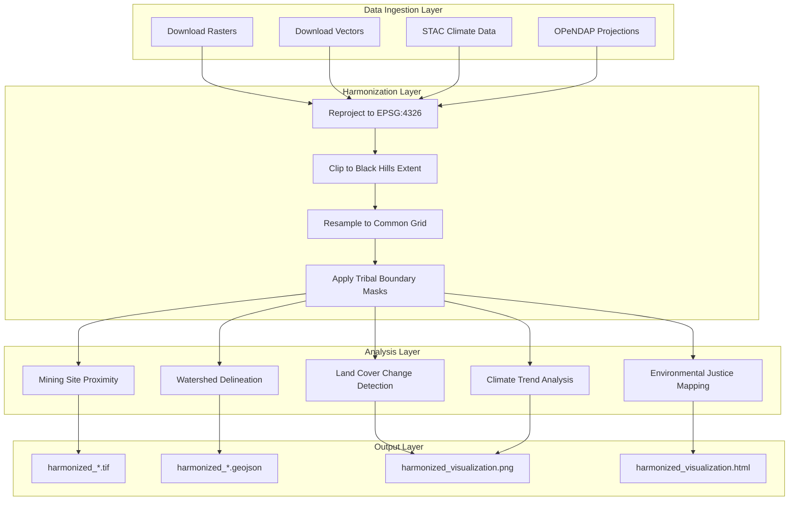

# Black Hills Mining & Water Impact Analysis - Harmonization Plan

## Project Overview

**Objective**: Harmonize all available geospatial datasets covering the Black Hills region (South Dakota & Wyoming) to assess historical and future impacts of mining on water resources, with emphasis on sovereign tribal lands.

**Key Themes**:
- Mining contamination & water quality
- Hydrological systems & watersheds
- Tribal sovereignty & environmental justice
- Land cover & vegetation change over time
- Climate trends & projections
- Fire history & fuel models

---

## 1. Spatial Extent

### Core Region: Black Hills
- **Primary coordinates**: ~44.1°N, 103.5°W (center of Black Hills)
- **Buffer**: 100 miles (~160 km) radius around Black Hills
- **Approximate bounding box**: (-105.5°, 42.5°, -101.5°, 45.5°) in EPSG:4326

### Coverage States
| State | FIPS | Counties in Buffer |
|-------|------|-------------------|
| South Dakota | 46 | Pennington, Meade, Fall River, Lawrence, Oglala Lakota |
| Wyoming | 56 | Niobrara, Converse, Hot Springs |
| Nebraska | 31 | Keith, Garden (partial overlap) |

### Tribal Lands Priority
- **Pine Ridge Indian Reservation** (Oglala Sioux Tribe)
- **Rosebud Indian Reservation** (Sicangu Lakota)
- **Black Hills Six Tribes**: Oglala, Sicangu, Hunkpapa, Miniconjou, Itazipco, Sihasapa
- **Wind River Reservation** (Eastern Shoshone & Northern Arapaho) - partial overlap

---

## 2. Dataset Inventory

### A. Mining & Contamination (Primary Focus)

| Dataset | Type | Temporal | Relevance |
|---------|------|----------|-----------|
| [EPA Uranium Mine Locations](data_catalog.yml:135) | vector | Historical | Direct - uranium mining sites |
| [HOLC Redlining — National](data_catalog.yml:178) | vector | 2020 tracts | Environmental justice context |
| [EPA Air Quality Index by County 2022](data_catalog.yml:114) | vector | 2022 | Air quality baseline |

### B. Hydrology & Water Resources (Primary Focus)

| Dataset | Type | Temporal | Relevance |
|---------|------|----------|-----------|
| [USGS WBD — National](data_catalog.yml:142) | vector | Static | Watershed boundaries (HUC2-HUC12) |
| [USGS 3DHP — National CONUS](data_catalog.yml:204) | vector | FY26 | Flowlines, waterbodies, drainage |
| [TerraClimate Monthly](data_catalog.yml:318) | raster | 1958-2021 | Soil moisture, SWE, precipitation, drought |
| [Daymet Daily North America](data_catalog.yml:344) | raster | 1980-2020 | Daily precipitation, SWE, temperature |
| [NOAA NClimGrid Monthly](data_catalog.yml:332) | raster | 1895-present | Long-term climate baseline |
| [ERA5 Hourly Reanalysis](data_catalog.yml:304) | raster | 1979-present | Atmospheric reanalysis |

### C. Land Cover & Vegetation Change (Secondary Focus)

| Dataset | Type | Temporal | Relevance |
|---------|------|----------|-----------|
| [NLCD Annual CONUS](data_catalog.yml:123) | raster | 2001-2024 | Land cover classification |
| [Hansen Global Forest Change 2024](data_catalog.yml:216) | raster | 2000-2024 | Forest loss/gain, tree cover |
| [USDA Cropland Data Layer](data_catalog.yml:194) | raster | 2008-present | Agricultural land use |
| [FBFM40 Fire Behavior Fuel Models 2024](data_catalog.yml:76) | raster | 2024 | Vegetation/fuel types |

### D. Climate Projections (Future Impact Assessment)

| Dataset | Type | Temporal | Relevance |
|---------|------|----------|-----------|
| [NASA NEX-GDDP-CMIP6](data_catalog.yml:358) | raster | 1950-2100 | Downscaled climate projections |
| [MACAv2 Winter Precipitation](data_catalog.yml:87) | raster | 2006-2099 | CMIP5 projections (RCP8.5) |

### E. Tribal & Administrative Boundaries (Context)

| Dataset | Type | Temporal | Relevance |
|---------|------|----------|-----------|
| [Census TIGER AIANNH 2025](data_catalog.yml:160) | vector | 2025 | Tribal area boundaries |
| [National Atlas of Indian Lands](data_catalog.yml:169) | vector | Historical | Historical Indian lands |
| [Census TIGER States 2025](data_catalog.yml:239) | vector | 2025 | State boundaries |
| [Census TIGER Counties 2025](data_catalog.yml:246) | vector | 2025 | County boundaries |
| [Census TIGER Places 2025](data_catalog.yml:263) | vector | 2025 | City/town boundaries |

### F. Infrastructure & Fire History (Context)

| Dataset | Type | Temporal | Relevance |
|---------|------|----------|-----------|
| [Microsoft Building Footprints](data_catalog.yml:283) | vector | Static | Human settlement patterns |
| [MTBS Burned Area Boundaries](data_catalog.yml:97) | vector | 1984-present | Fire history |

---

## 3. Workflow Architecture



---

## 4. Implementation Plan

### Phase 1: Setup & Validation
1. Create `workflows/black_hills_mining_water_impact/` directory
2. Write `black_hills_harmonization.py` with bootstrap header
3. Validate all dataset URLs with `python scripts/check_urls.py`
4. Define extended Black Hills bounding box

### Phase 2: Core Harmonization Script
Configure `DatasetSpec` objects for all datasets:

```python
# Mining & Contamination
DatasetSpec(
    name="uranium_mine_locations",
    display_name="Uranium Mine Sites",
    description="EPA uranium mining locations",
    url="https://www.epa.gov/sites/default/files/2015-03/uld-ii_gis.zip",
    data_type="vector",
    rasterize=False,
)

# Hydrology
DatasetSpec(
    name="watershed_boundaries",
    display_name="Watershed Boundaries",
    description="USGS HUC2-HUC12 watershed delineations",
    url="https://prd-tnm.s3.amazonaws.com/StagedProducts/Hydrography/WBD/National/GDB/WBD_National_GDB.zip",
    data_type="vector",
    rasterize=False,
)

DatasetSpec(
    name="hydrography_3dhp",
    display_name="3D Hydrography",
    description="USGS flowlines, waterbodies, drainage areas",
    url="https://prd-tnm.s3.amazonaws.com/StagedProducts/Hydrography/3DHP/Annual/GPKG/3dhp_all_GPKG_FY26_CONUS_20260112/3dhp_all_CONUS_20260112_GPKG.zip",
    data_type="vector",
    rasterize=False,
)

# Tribal Lands
DatasetSpec(
    name="tribal_boundaries_aiannh",
    display_name="Tribal Area Boundaries",
    description="Census AIANNH 2025 tribal boundaries",
    url="https://www2.census.gov/geo/tiger/TIGER2025/AIANNH/tl_2025_us_aiannh.zip",
    data_type="vector",
    rasterize=False,
)

DatasetSpec(
    name="national_atlas_indian_lands",
    display_name="Historical Indian Lands",
    description="National Atlas of Indian Lands boundaries",
    url="https://prd-tnm.s3.amazonaws.com/StagedProducts/Small-scale/data/Boundaries/indlanp010g.shp_nt00968.tar.gz",
    data_type="vector",
    rasterize=False,
)

# Land Cover - NLCD (multiple years)
DatasetSpec(
    name="nlcd_2024",
    display_name="Land Cover 2024",
    description="NLCD annual land cover classification",
    url="https://www.mrlc.gov/downloads/sciweb1/shared/mrlc/data-bundles/Annual_NLCD_LndCov_2024_CU_C1V1.zip",
    data_type="raster",
    resampling_method="nearest",
)

# Forest Change - Hansen
DatasetSpec(
    name="hansen_forest_loss",
    display_name="Forest Loss Year",
    description="Hansen Global Forest Change loss year",
    url="https://storage.googleapis.com/earthenginepartners-hansen/GFC-2024-v1.12/Hansen_GFC-2024-v1.12_lossyear_50N_110W.tif",
    data_type="raster",
    resampling_method="nearest",
)

DatasetSpec(
    name="hansen_tree_cover_2000",
    display_name="Tree Cover 2000",
    description="Hansen tree canopy cover baseline",
    url="https://storage.googleapis.com/earthenginepartners-hansen/GFC-2024-v1.12/Hansen_GFC-2024-v1.12_treecover2000_50N_110W.tif",
    data_type="raster",
    resampling_method="bilinear",
)

# Climate - TerraClimate (STAC)
DatasetSpec(
    name="terraclimate_precipitation",
    display_name="Monthly Precipitation",
    description="TerraClimate precipitation 1958-2021",
    url="https://planetarycomputer.microsoft.com/api/stac/v1",
    data_type="raster",
    is_stac=True,
    stac_collection="terraclimate",
    stac_asset="ppt",
)

DatasetSpec(
    name="terraclimate_drought",
    display_name="Drought Index PDSI",
    description="TerraClimate Palmer Drought Severity Index",
    url="https://planetarycomputer.microsoft.com/api/stac/v1",
    data_type="raster",
    is_stac=True,
    stac_collection="terraclimate",
    stac_asset="pdsi",
)

# County & State Boundaries
DatasetSpec(
    name="county_boundaries",
    display_name="County Boundaries",
    description="Census TIGER 2025 county polygons",
    url="https://www2.census.gov/geo/tiger/TIGER2025/COUNTY/tl_2025_us_county.zip",
    data_type="vector",
    rasterize=False,
)

DatasetSpec(
    name="state_boundaries",
    display_name="State Boundaries",
    description="Census TIGER 2025 state polygons",
    url="https://www2.census.gov/geo/tiger/TIGER2025/STATE/tl_2025_us_state.zip",
    data_type="vector",
    rasterize=False,
)

# Fire History
DatasetSpec(
    name="mtbs_burned_areas",
    display_name="Fire Perimeters",
    description="MTBS burned area boundaries 1984-present",
    url="https://edcintl.cr.usgs.gov/downloads/sciweb1/shared/MTBS_Fire/data/composite_data/burned_area_extent_shapefile/mtbs_perimeter_data.zip",
    data_type="vector",
    rasterize=False,
)

# Building Footprints
DatasetSpec(
    name="building_footprints_sd",
    display_name="Building Footprints SD",
    description="Microsoft building footprints South Dakota",
    url="https://minedbuildings.z5.web.core.windows.net/legacy/usbuildings-v2/SouthDakota.geojson.zip",
    data_type="vector",
    rasterize=True,
)

# Fuel Models
DatasetSpec(
    name="fbfm40_fuel_models",
    display_name="Fire Fuel Models",
    description="LANDFIRE FBFM40 fuel models 2024",
    url="https://www.landfire.gov/data-downloads/CONUS_LF2024/LF2024_FBFM40_CONUS.zip",
    data_type="raster",
    resampling_method="nearest",
    labels_url="https://landfire.gov/sites/default/files/CSV/2024/LF2024_FBFM40.csv",
)
```

### Phase 3: Workflow Configuration

```python
# Extended Black Hills bounding box (~100 mile buffer)
BLACK_HILLS_EXTENT = (-105.5, 42.5, -101.5, 45.5)

workflow = ExampleWorkflow(
    name="black_hills_mining_water_impact",
    datasets=DATASETS,
    target_crs="EPSG:4326",
    target_extent=BLACK_HILLS_EXTENT,
    target_resolution=0.00243,  # ~270m
    output_dir=OUTPUT_DIR,
    create_visualization=True,
    verbose=True,
    clip_boundary=None,  # Use bounding box for extended region
)
```

### Phase 4: Execution & Monitoring
1. Run URL health checks
2. Execute with `nohup python workflows/black_hills_mining_water_impact/black_hills_harmonization.py`
3. Monitor `.status` file (2 min initial, then 3 min intervals)
4. Poll log file for completion

### Phase 5: Documentation
1. Create `docs/workflows/black_hills_mining_water_impact.md`
2. Copy `harmonized_visualization.png` to `docs/assets/workflows/black_hills_mining_water_impact/`
3. Append to `PROMPT_ACTION_LOG.md`
4. Update `data_catalog.yml` if new datasets added

---

## 5. Expected Outputs

| Output | Format | Description |
|--------|--------|-------------|
| `harmonized_uranium_mine_locations.geojson` | vector | Mine sites clipped to region |
| `harmonized_watershed_boundaries.geojson` | vector | HUC boundaries |
| `harmonized_hydrography_3dhp.geojson` | vector | Flowlines & waterbodies |
| `harmonized_tribal_boundaries_aiannh.geojson` | vector | Tribal areas |
| `harmonized_national_atlas_indian_lands.geojson` | vector | Historical lands |
| `harmonized_nlcd_2024.tif` | raster | Current land cover |
| `harmonized_hansen_forest_loss.tif` | raster | Forest loss years |
| `harmonized_hansen_tree_cover_2000.tif` | raster | Baseline tree cover |
| `harmonized_terraclimate_precipitation.tif` | raster | Climate precipitation |
| `harmonized_terraclimate_drought.tif` | raster | Drought index |
| `harmonized_county_boundaries.geojson` | vector | County polygons |
| `harmonized_state_boundaries.geojson` | vector | State polygons |
| `harmonized_mtbs_burned_areas.geojson` | vector | Fire perimeters |
| `harmonized_building_footprints_sd.tif` | raster | Buildings rasterized |
| `harmonized_fbfm40_fuel_models.tif` | raster | Fuel models |
| `harmonized_visualization.png` | image | Multi-panel figure |
| `harmonized_visualization.html` | interactive | Folium map |

---

## 6. Key Considerations for Tribal Lands Analysis

1. **Sovereignty Recognition**: Tribal boundaries from AIANNH and National Atlas provide legal jurisdiction context
2. **Environmental Justice**: Overlay mining sites with tribal lands to identify disproportionate impacts
3. **Water Rights**: Watershed boundaries intersecting tribal lands are critical for water resource analysis
4. **Historical Context**: National Atlas of Indian Lands shows historical extent vs. current boundaries
5. **Cultural Resources**: Proximity analysis between mining sites and tribal areas

---

## 7. Next Steps

- [ ] Switch to Code mode to implement the workflow
- [ ] Create directory structure
- [ ] Write harmonization script
- [ ] Validate URLs
- [ ] Execute and monitor
- [ ] Generate documentation
